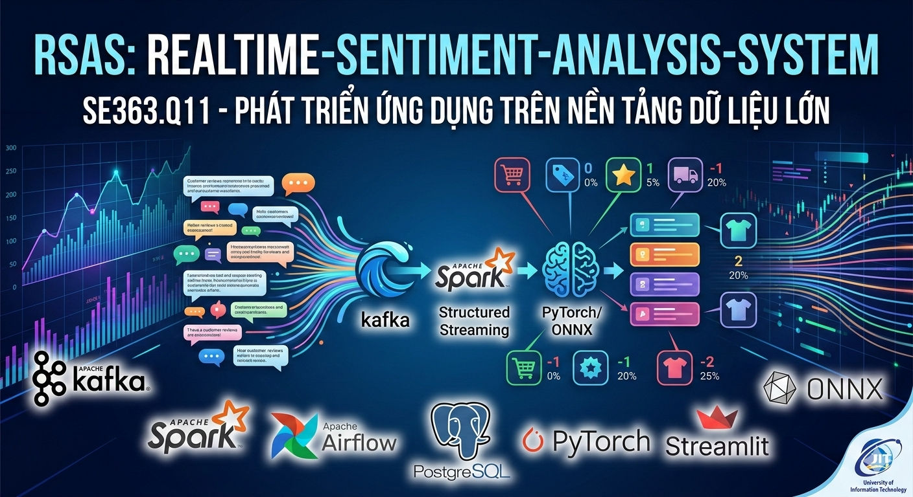

<p align="center">
  <a href="https://www.uit.edu.vn/" title="University of Information Technology" style="border: none;">
    
  </a>
</p>

<h1 align="center"><b>SE363.Q12 - Real-time Sentiment Analysis System</b></h1>

# **SE363 Personal Project: Real-time Sentiment Analysis System (RSAS)**

> This project focuses on building an **Aspect-Based Sentiment Analysis (ABSA)** system within a Big Data environment. The system automatically classifies customer complaints and reviews into specific aspects, enabling businesses to optimize their product improvement strategies.
> **Technical Highlights:** Integration of **Kafka** and **Spark Structured Streaming** for real-time processing, and **Apache Airflow** to automate model retraining and deployment (MLOps/CI-CD for ML).

<p align="center">
  
</p>
---

## **Team Information**

| No. | Student ID | Full Name | Role | Github | Email |
| --- | --- | --- | --- | --- | --- |
| 1 | 23521329 | Nguyen Van Quyen | Developer | [quyen244](https://github.com/quyen244) | 23521329@gm.uit.edu.vn |

---

## **Table of Contents**

* [Overview](https://www.google.com/search?q=%23overview)
* [System Architecture](https://www.google.com/search?q=%23system-architecture)
* [Tech Stack](https://www.google.com/search?q=%23tech-stack)
* [Database Schema](https://www.google.com/search?q=%23database-schema)
* [Features](https://www.google.com/search?q=%23features)
* [Repository Structure](https://www.google.com/search?q=%23repository-structure)
* [Installation & Usage](https://www.google.com/search?q=%23installation--usage)

---

## **Overview**

The system addresses the Aspect-Based Sentiment Analysis (ABSA) problem across 8 key aspects: `Price`, `Shipping`, `Outlook`, `Quality`, `Size`, `Shop_Service`, `General`, and `Others`.

**Data Labeling Conventions:**

* `-1`: None (Not mentioned)
* `0`: Negative
* `1`: Neutral
* `2`: Positive

---

## **System Architecture**

The system is designed with a robust streaming architecture to ensure high scalability:

1. **Data Ingestion:** Data from files or scrapers is pushed into **Kafka** topics.
2. **Stream Processing:** **Spark Structured Streaming** consumes the data and applies the `model.onnx` for real-time sentiment labeling.
3. **Storage:** Analysis results and model version history are stored in **PostgreSQL**.
4. **Orchestration:** **Airflow** orchestrates periodic retraining pipelines and automatically updates the production model if the new version performs better.
5. **Visualization:** **Streamlit** provides an interactive Dashboard for end-users to monitor trends.

---

## **Tech Stack**

| Layer | Technology | Role |
| --- | --- | --- |
| **Ingestion** | Apache Kafka | Message Broker for data streams |
| **Processing** | Apache Spark | Streaming engine and data preprocessing |
| **Orchestration** | Apache Airflow | Automated retraining & workflow management |
| **Database** | PostgreSQL | Storage for results and model metadata |
| **ML Model** | PyTorch (ABSA) | Hard-sharing Multitask Learning model |
| **Frontend** | Streamlit | Real-time reporting dashboard |

---

## **Database Schema**

### **1. Sentiment Analysis Table (`sentiment_analysis`)**

Stores prediction results from Spark Streaming.

```sql
CREATE TABLE sentiment_analysis(
    id SERIAL PRIMARY KEY,
    review TEXT NOT NULL,
    pred_price INTEGER,
    pred_shipping INTEGER,
    pred_outlook INTEGER,
    pred_quality INTEGER,
    pred_size INTEGER,
    pred_shop_service INTEGER,
    pred_general INTEGER,
    pred_others INTEGER,
    processed_at TIMESTAMP DEFAULT CURRENT_TIMESTAMP
);

```

### **2. Model Version Management (`model_versions`)**

Supports Airflow's Automated Retraining feature.

```sql
CREATE TABLE model_versions(
    version VARCHAR(50) PRIMARY KEY,
    model_path TEXT NOT NULL,
    avg_accuracy DOUBLE PRECISION,
    avg_f1_score DOUBLE PRECISION,
    is_production BOOLEAN DEFAULT FALSE,
    notes TEXT,
    created_at TIMESTAMP DEFAULT CURRENT_TIMESTAMP
);

```

---

## **Features**

* ✅ **Real-time Processing:** Process and classify comments instantaneously as they arrive.
* ✅ **Automated Retraining:** Airflow automatically triggers training tasks when new data is available.
* ✅ **Model Selection:** Automatically deploys new models only if metrics ($Accuracy, F1$) exceed the current production version.
* ✅ **Containerization:** All services are Dockerized for easy deployment and management.
* ✅ **Model Format:** Models are converted to **ONNX** format to significantly accelerate inference speed.

---

## **Repository Structure**

```text
.
├── airflow-docker/         # Docker config & Airflow DAGs
│   ├── dags/               # Automated retraining workflows
│   ├── Dockerfile.spark    # Custom Spark worker image
│   └── docker-compose.yaml # Orchestration file
├── data/                   # Sample Datasets (Train/Val/Test)
├── models/                 # Storage for .pt and .onnx models
├── src/                    # Source code
│   ├── producer.py         # Data stream simulator (Kafka producer)
│   ├── consumer.py         # Spark Streaming logic
│   ├── train_model.py      # Model retraining script
│   └── dashboard.py        # Streamlit UI
└── init_db.sql             # Database initialization script

```

---

## **Installation & Usage**

### **1. Start All Services (Docker)**

```bash
docker-compose up -d

```

### **2. Run Streaming Pipeline**

```bash
# Start the producer to stream data
python src/producer.py

# Start the Spark Consumer
python src/consumer.py

```

### **3. Access the Dashboard**

```bash
# Run the Streamlit application
streamlit run src/dashboard.py

```
