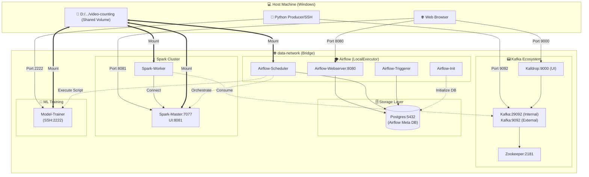

<p align="center">
  <a href="https://www.uit.edu.vn/" title="University of Information Technology" style="border: none;">
    
  </a>
</p>

<h1 align="center"><b>SE363.Q12 - Real-time Sentiment Analysis System</b></h1>

# **SE363 Personal Project: Real-time Sentiment Analysis System (RSAS)**

> This project focuses on building an **Aspect-Based Sentiment Analysis (ABSA)** system within a Big Data environment. The system automatically classifies customer complaints and reviews into specific aspects, enabling businesses to optimize their product improvement strategies.
> **Technical Highlights:** Integration of **Kafka** and **Spark Structured Streaming** for real-time processing, and **Apache Airflow** to automate model retraining and deployment (MLOps/CI-CD for ML).

<p align="center">
  
</p>
---

## **Team Information**

| No. | Student ID | Full Name | Role | Github | Email |
| --- | --- | --- | --- | --- | --- |
| 1 | 23521329 | Nguyen Van Quyen | Developer | [quyen244](https://github.com/quyen244) | 23521329@gm.uit.edu.vn |

---

## **Table of Contents**

* [Overview](#overview)
* [System Architecture](#system-architecture)
* [Tech Stack](#tech-stack)
* [Database Schema](#database-schema)
* [Features](#features)
* [Repository Structure](#repository-structure)
* [Installation & Usage](#installation--usage)

---

## **Overview**

The system addresses the Aspect-Based Sentiment Analysis (ABSA) problem across 8 key aspects: `Price`, `Shipping`, `Outlook`, `Quality`, `Size`, `Shop_Service`, `General`, and `Others`.

**Data Labeling Conventions:**

* `-1`: None (Not mentioned)
* `0`: Negative
* `1`: Neutral
* `2`: Positive

---

## **System Architecture**

The system is designed with a robust streaming architecture to ensure high scalability:

1. **Data Ingestion:** Data from files or scrapers is pushed into **Kafka** topics.
2. **Stream Processing:** **Spark Structured Streaming** consumes the data and applies the `model.onnx` for real-time sentiment labeling.
3. **Storage:** Analysis results and model version history are stored in **PostgreSQL**.
4. **Orchestration:** **Airflow** orchestrates periodic retraining pipelines and automatically updates the production model if the new version performs better.
5. **Visualization:** **Streamlit** provides an interactive Dashboard for end-users to monitor trends.

### visualization about docker interactions 




---

## **Tech Stack**

| Layer | Technology | Role |
| --- | --- | --- |
| **Ingestion** | Apache Kafka | Message Broker for data streams |
| **Processing** | Apache Spark | Streaming engine and data preprocessing |
| **Orchestration** | Apache Airflow | Automated retraining & workflow management |
| **Database** | PostgreSQL | Storage for results and model metadata |
| **ML Model** | PyTorch (ABSA) | Hard-sharing Multitask Learning model |
| **Frontend** | Streamlit | Real-time reporting dashboard |

---

## **Database Schema**

### **1. Sentiment Analysis Table (`sentiment_analysis`)**

Stores prediction results from Spark Streaming.

```sql
CREATE TABLE sentiment_analysis(
    id SERIAL PRIMARY KEY,
    review TEXT NOT NULL,
    pred_price INTEGER,
    pred_shipping INTEGER,
    pred_outlook INTEGER,
    pred_quality INTEGER,
    pred_size INTEGER,
    pred_shop_service INTEGER,
    pred_general INTEGER,
    pred_others INTEGER,
    processed_at TIMESTAMP DEFAULT CURRENT_TIMESTAMP
);

```

### **2. Model Version Management (`model_versions`)**

Supports Airflow's Automated Retraining feature.

```sql
CREATE TABLE model_versions(
     version varchar(50) NOT NULL PRIMARY KEY,
    model_path text NOT NULL,
    accuracy_price double precision,
    accuracy_shipping double precision,
    accuracy_outlook double precision,
    accuracy_quality double precision,
    accuracy_size double precision,
    accuracy_shop_service double precision,
    accuracy_general double precision,
    accuracy_others double precision,
    avg_accuracy double precision,
    f1_score_price double precision,
    f1_score_shipping double precision,
    f1_score_outlook double precision,
    f1_score_quality double precision,
    f1_score_size double precision,
    f1_score_shop_service double precision,
    f1_score_general double precision,
    f1_score_others double precision,
    avg_f1_score double precision,
    is_production boolean DEFAULT false,
    notes text,
    created_at timestamp without time zone DEFAULT CURRENT_TIMESTAMP,
);

```

---

## **Features**

* ✅ **Real-time Processing:** Process and classify comments instantaneously as they arrive.
* ✅ **Automated Retraining:** Airflow automatically triggers training tasks when new data is available.
* ✅ **Run end-to-end pipeline:** irflow automatically triggers pipeline by connecting to service through SSH sever and executing commands.
* ✅ **Model Selection:** Automatically deploys new models only if metrics ($Accuracy, F1$) exceed the current production version.
* ✅ **Containerization:** All services are Dockerized for easy deployment and management.
* ✅ **Model Format:** Models are converted to **ONNX** format to significantly accelerate inference speed.


---

## **Repository Structure**

```text
├── airflow-docker/          # Infrastructure Orchestration & Containerization
│   ├── dags/                # Airflow DAG definitions
│   │                        # Orchestrates automated retraining, evaluation, and deployment loops
│   ├── Dockerfile.spark     # Custom image for Spark Master/Workers (NLP & Big Data dependencies)
│   ├── Dockerfile.trainer   # Dedicated service for model training (Optimized for PyTorch/GPU)
│   └── docker-compose.yaml  # Full-stack orchestration (Airflow, Spark, Kafka, Postgres)
│
├── data/                    # Data Management (Versioning)
│   ├── raw/                 # Raw customer reviews and complaint datasets
│   └── processed/           # Labeled Aspect/Sentiment data for Train/Val/Test splits
│
├── models/                  # Artifact Registry (Model Storage)
│   ├── checkpoint/          # Intermediate training weights (.pt)
│   └── production/          # Optimized production-ready models (.onnx) for high-speed inference
│
├── src/                     # Core Source Code
│   ├── config.py            # Global configurations (Kafka topics, Spark parameters, paths)
│   ├── producer.py          # Data stream simulator (Ingests reviews into Kafka Broker)
│   ├── consumer.py          # The engine: Spark Structured Streaming for real-time ABSA prediction
│   │                        # Processes live streams and sinks results to Postgres
│   ├── train_model.py       # ABSA model training logic (Deep Learning pipeline)
│   ├── evaluate_model.py    # Performance validation (F1-score, Accuracy per Aspect metrics)
│   └── dashboard.py         # Streamlit UI for real-time sentiment visualization
│
├── init_db.sql              # Database schema initialization (Streaming results & Metadata tables)
└── requirements.txt         # Python dependency manifest

```

---

## **Installation & Usage**

### **1. Start All Services (Docker)**

```bash
docker-compose up -d

```

### **2. Run Streaming Pipeline**

```bash
# Start the producer to stream data
python src/producer.py

# Start the Spark Consumer
python src/consumer.py

```

### **3. Access the Dashboard**

```bash
# Run the Streamlit application
streamlit run src/dashboard.py

```
